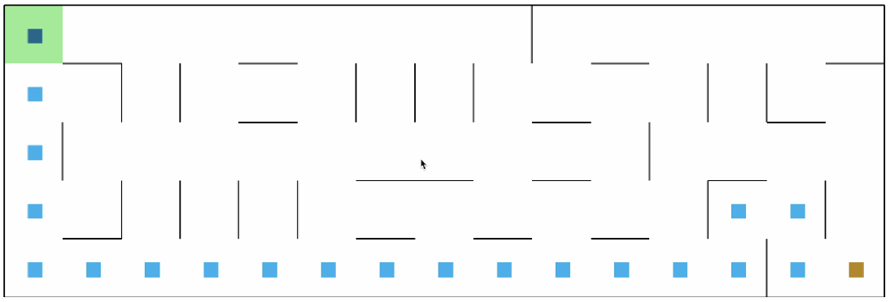
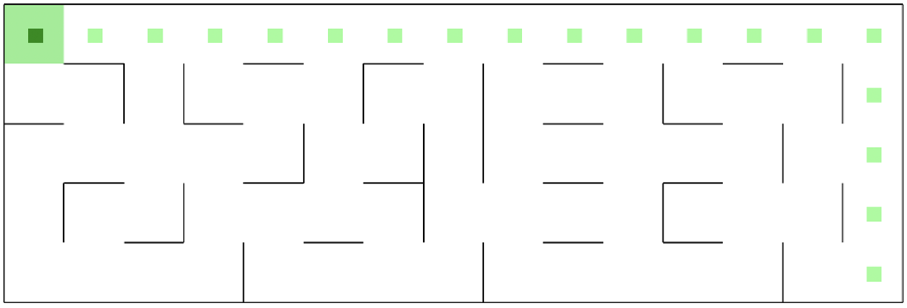
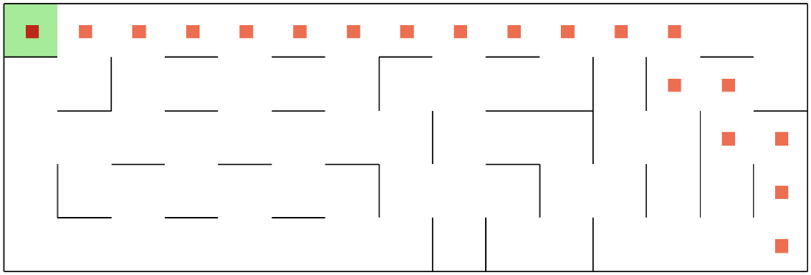
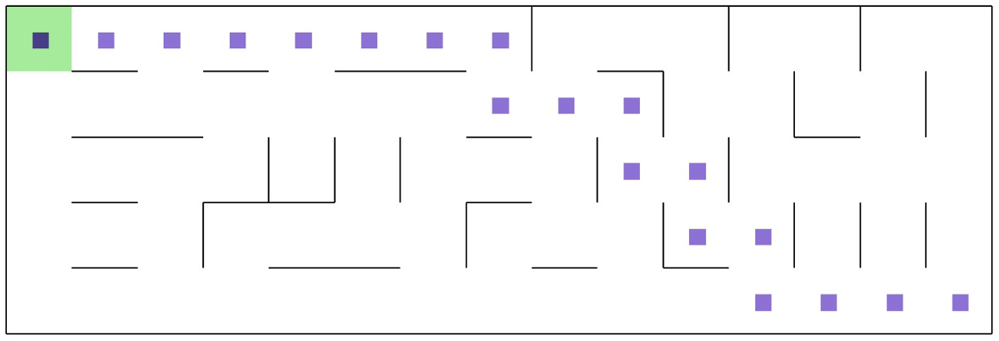
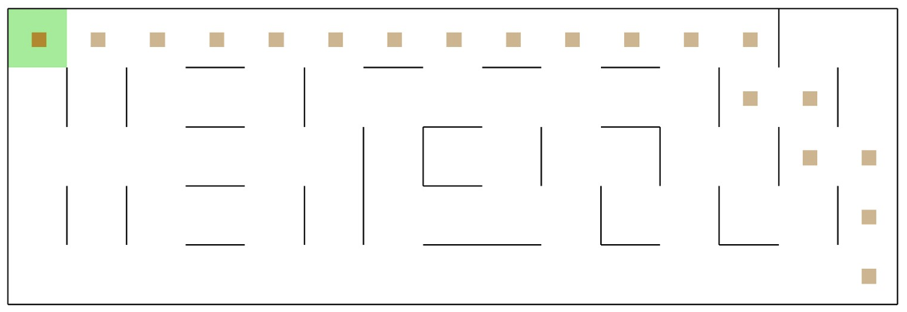

# AIMazeSolvers #

### DFS ###

### BFS ###

### A-STAR ###

### MDP - Value Iteration ###

### MDP - Policy Iteration ###

This project contains a Python implementation for solving mazes of varying sizes. The project has five algorithms for solving mazes, three of which are search-based algorithms (BFS, DFS, and A*) and two are MDP-based algorithms (value iteration and policy iteration). The performance of these algorithms is compared and analyzed using various metrics on three different sizes of mazes.

## Maze Generation ##

The mazes are randomly generated and have multiple paths from the starting point to the goal point, with obstacles placed randomly throughout the maze.

## Performance Metrics ##

The following metrics are used to measure the performance of the algorithms:

 - Execution Time: This metric represents the total time required to execute the algorithm on a randomly generated maze of a given size. It is used in both search and MDP-based algorithms.
 - Memory Usage: This metric represents the amount of memory used by the algorithm to run and store the results. It is used in both search and MDP-based algorithms.

## Maze Sizes ##

Three maze sizes are considered in this project to analyze and compare the performance of the algorithms:

 - 5 X 15 Maze: A maze with 5 rows and 15 columns
 - 15 X 5 Maze: A maze with 15 rows and 5 columns
 - 30 X 30 Maze: A large maze with 30 rows and 30 columns

## Algorithms ##

The project includes five algorithms for solving the maze:

 - Depth First Search (DFS)
 - Breadth First Search (BFS)
 - A-Star Algorithm
 - Value Iteration
 - Policy Iteration

## Design Choices ##

The A-Star Algorithm uses the Manhattan Distance as its heuristic function, as it is admissible and efficient, considering only the horizontal and vertical distance between two nodes.

The MDP algorithms use the following design choices:

 - Negative reward for every transition state: -1
 - Positive reward for reaching the goal: 1000
 - Negative reward for invalid moves: -1000
 - Discount factor (γ): 0.9
 - Theta (Convergence Threshold): 0.001

## Results and Comparison ##

The algorithms are compared and analyzed using the following metrics:

 - Execution Time
 - Memory Consumption
 
The comparison between MDP-based and search-based algorithms is shown below:

| Algorithm | Maze Size | Execution Time (ms) | Memory Consumed (KB) |
|-----------|----------|---------------------|----------------------|
| DFS       | 5x15     | 0.08                | 3.2                 |
| DFS       | 15x5     | 0.05                | 4.0                 |
| DFS       | 30x30    | 0.36                | 10.0                |
| BFS       | 5x15     | 0.15                | 4.7                 |
| BFS       | 15x5     | 0.12                | 4.7                 |
| BFS       | 30x30    | 10.7                | 66.0                |
| A*        | 5x15     | 0.18                | 18.0                |
| A*        | 15x5     | 0.14                | 18.0                |
| A*        | 30x30    | 0.92                | 134.0               |
| Value Iteration | 5x15  | 4.0               | 34.0                |
| Value Iteration | 15x5  | 5.0               | 34.0                |
| Value Iteration | 30x30 | 103.0             | 650.0               |
| Policy Iteration | 5x15  | 26.0             | 102.0               |
| Policy Iteration | 15x5  | 20.0             | 102.0               |
| Policy Iteration | 30x30 | 231.0            | 1453.0              |

## Steps to Run the Project ##

Follow the below steps to run the project:

 1. Open the unzipped folder and launch Terminal/Powershell inside the folder.

`cd path/to/unzipped/folder`

 2. Install the requirements by installing the packages in requirement.txt file using the below command.

`pip install -r requirements.txt`

 3. After installation of all the packages, open your python interpreter by using the command below.
 
 `python`
 
      Note: if the above command for launching python interpreter does not work, please check your python version or try 'py' or 'python3'
 
 4. Import the maze.py file by using the below command.
 
 `import maze`
 
 5. To run all the search and mdp algorithms use the following command.

 `maze.run_maze_ai(5, 15, 'all')`
 
      Note: The first argument in run_maze_ai method specifies the number of rows, second argument specifies the number of columns, and      the third argument specifies the algorithm to run. Here are the list of options which can be used:
 
      - Runs DFS Algorithm on maze consisting of 5 rows and 15 columns
 
     `maze.run_maze_ai(5, 15, 'dfs')` 

      - Runs BFS Algorithm on maze consisting of 5 rows and 15 columns

     `maze.run_maze_ai(5, 15, 'bfs')`

      - Runs A-STAR Algorithm on maze consisting of 5 rows and 15 columns

     `maze.run_maze_ai(5, 15, 'astar')`

      - Runs Value Iteration Algorithm on maze consisting of 5 rows and 15 columns

     `maze.run_maze_ai(5, 15, 'value_iteration')`

      - Runs Policy Iteration Algorithm on maze consisting of 5 rows and 15 columns

     `maze.run_maze_ai(5, 15, 'policy_iteration') `

 
 6. To check the memory used by the algorithms, run the below function with the same list of arguments and options mentioned in STEP - 5. For example:
 
     -It outputs the current memory and peak memory used to execute the DFS algorithm on maze consisting of 5 rows and 15 columns
 
     `maze.maze_memory_usage(5, 15, 'dfs')`

